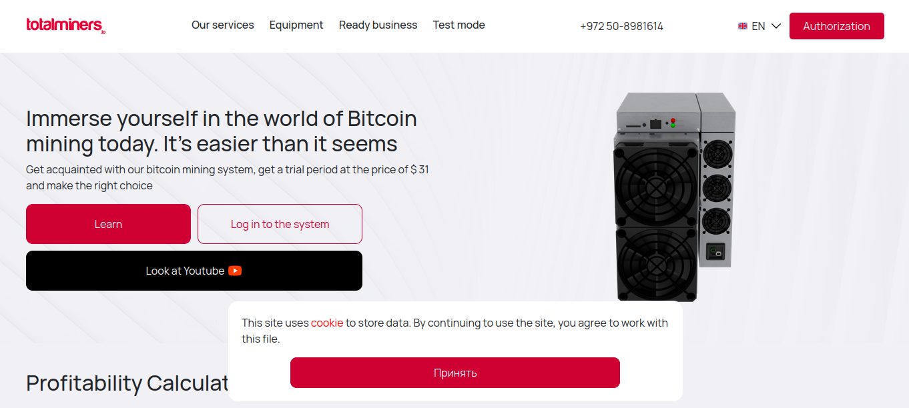
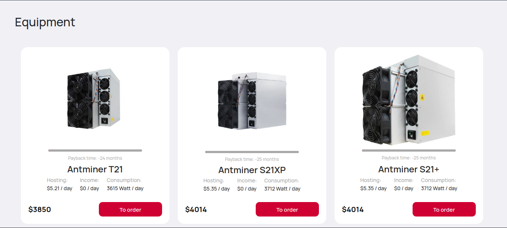
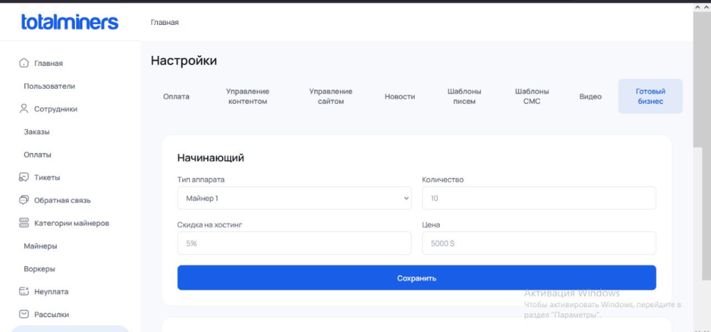

# TotalMiners Public Website ⛏️

<p align="center">
  <a href="https://totalminers.io"><strong>totalminers.io</strong></a>
</p>

<p align="center">
  
  
  
  
  
</p>


The official public-facing web platform and user dashboard for the **totalminers.io** mining hotel infrastructure. This frontend application serves as the primary hub for clients to calculate mining profitability, manage hardware units, and monitor live performance data.

---
<p align="center">
  
</p>


## 🛠️ Tech Stack & Key Features

* **UI Architecture:** Built on `Vue.js` (Vue CLI) with a responsive, component-driven dashboard system.
* **Advanced Visualizations (Chart.js):** Powered by `Chart.js` to render high-fidelity, interactive historical tracking models, including:
  * Live Bitcoin (BTC) market price trends.
  * Personal mining statistics, hashrate fluctuations, and performance metrics.
* **Hardware Power Calculator:** An interactive hardware computation module allowing users to input specific parameters and instantly calculate power requirements, costs, and potential mining yields.
* **Microservices & REST API Integration:** Heavily integrated into a distributed ecosystem. The client-side application orchestrates communication across multiple backend microservices via REST API to perform direct, real-time miner hardware manipulation.
* **Web Server & Reverse Proxy:** Structured with a production-optimized `Nginx` server configuration to ensure secure static routing and seamless Single Page Application (SPA) routing fallbacks.
* **Containerization:** Bundled within a standalone, multi-stage `Docker` configuration for optimized deployment pipelines.
* * **Many-languages, uses i18n:** Using data-objects for translate text.

---
<p align="center">
  
</p>
<p align="center">
  
</p>

## 🚀 Local Development Workflow

### 1. Dependency Resolution
Fetch and install all localized frontend packages:
```bash
npm install
```

### 2. Live Hot-Reload Server
Launch the local development engine:
```bash
npm run serve
```
> The web application will immediately spin up and point to: `http://localhost:8080/`

### 3. Production Resource Bundling
Compile, minify, and compress assets for deployment:
```bash
npm run build
```

### 4. Code Hygiene & Linting
Examine script parameters and automatically fix syntax anomalies:
```bash
npm run lint
```

---

## 🐳 Containerized Production Deployment

The project contains a pre-configured Docker pipeline that aggregates structural dependencies into automated, highly cached builds.

### Compile and Start Container Assets:

1. **Build the image artifact:**
   ```bash
   docker build -t website-mining .
   ```

2. **Boot the isolated web layer (listening on HTTP port 80):**
   ```bash
   docker run -d -p 80:80 --name totalminers-main-site website-mining
   ```

---

## 🗂️ Configuration Blueprints

* `nginx.conf` — Governs content caching headers, single-page application router fallbacks, and standard secure reverse proxy instructions.
* `vue.config.js` — Handles Webpack engine adjustments, path resolution shortcuts, and API proxy configuration hooks for local development.
